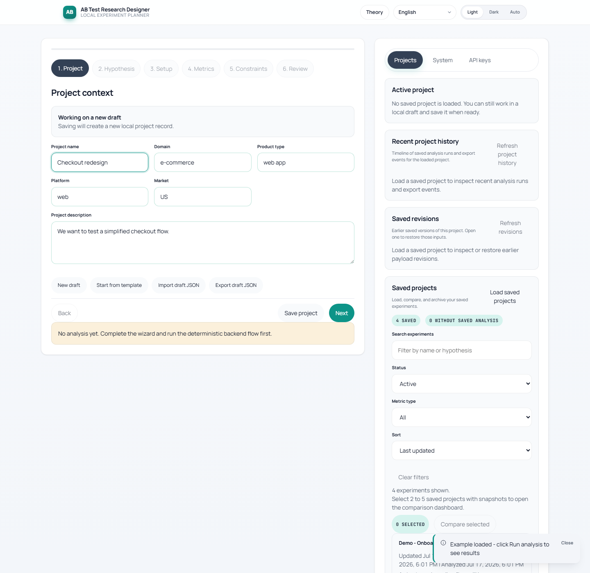
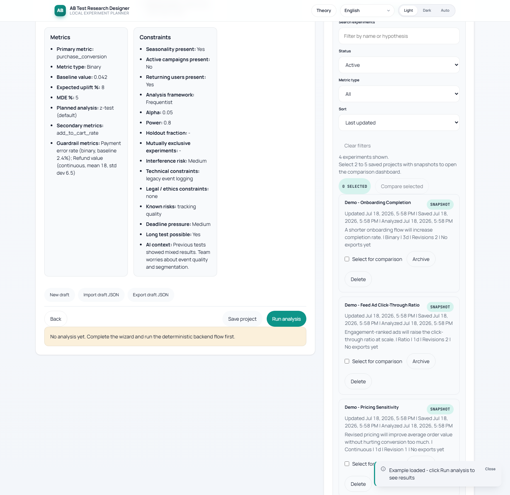
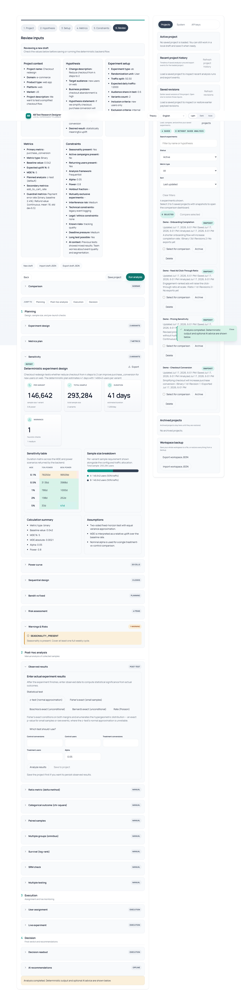

# AB Test Research Designer

[](https://github.com/brownjuly2003-code/ab-test-research-designer/releases)
[](LICENSE)
[](https://www.python.org/)
[](https://nodejs.org/)

Local-first experiment planning tool for A/B and multi-variant tests. Plan sample size and duration from the wizard, review deterministic statistical guidance (SRM, Bayesian, group-sequential, CUPED, guardrails), compare saved experiments side by side, and export decision-ready reports in four languages — all against a local SQLite workspace with no cloud required.

Built with **FastAPI + React 19 + TypeScript + Vite + SQLite**, verified end-to-end via `scripts/verify_all.cmd --with-e2e` (233 backend tests, 200+ frontend tests, Playwright E2E, Lighthouse CI, axe accessibility checks).

It combines:

- deterministic sample size and duration calculation
- heuristic warnings and feasibility checks
- deterministic experiment design output
- optional local LLM recommendations
- SQLite-backed project storage with history and export metadata
- lightweight runtime diagnostics plus request-id / process-time headers
- baseline security headers, API rate limiting, auth-failure throttling, and request-body size guards
- SQLite schema versioning plus configurable WAL/busy-timeout runtime settings
- optional API token protection for runtime and project APIs
- workspace backup and restore for saved projects plus history, integrity counts, checksums, and optional HMAC signatures
- preflight workspace validation before import, plus runtime SQLite write-probe diagnostics

## Demo

**Live demo:** https://liovina-ab-test-research-designer.hf.space (hosted on Hugging Face Spaces, free CPU tier — first cold request may take a few seconds)

Deploy your own: see [docs/DEPLOY.md](docs/DEPLOY.md). Release prep files: [fly.toml](fly.toml) and [docs/RELEASE_NOTES_v1.1.0.md](docs/RELEASE_NOTES_v1.1.0.md).

Sample import payload:

- [docs/demo/sample-project.json](docs/demo/sample-project.json)

Current workflow screenshots are generated by the smoke script into `docs/demo/`.
The smoke flow imports `docs/demo/sample-project.json`, verifies browser draft persistence,
runs analysis, and exports a report:





## Roadmap

Planned work after v1.1.0. See [progress.md](progress.md) for the full tiered backlog.

- **Portfolio polish.** Seed demo workspace on HF Space startup, regenerate screenshots against the v1.1.0 UI, add a case-study section, publish a Docker image to GHCR, add dynamic quality-gate badges.
- **Product quality.** Finish the German and Spanish UI translation, snapshot SQLite to a private HF Dataset for persistent hosted state, add an optional OpenAI / Anthropic adapter behind a browser-session token, publish a `mkdocs-material` documentation site, expand the template gallery to ten industry presets.
- **Hardening.** Monte-Carlo and permutation overlays in the comparison flow, Slack App packaging, French / Chinese locales, manual NVDA + JAWS audit, deeper Hypothesis property coverage, bundle-size profiling, optional Postgres backend.

## Product shape

- Frontend: React 19 + TypeScript + Vite
- Backend: FastAPI + Pydantic
- Storage: SQLite
- Optional AI path: local orchestrator adapter with retry/backoff
- Verification: backend tests, frontend unit tests, typecheck, build, smoke, Playwright E2E
- CI: [.github/workflows/test.yml](.github/workflows/test.yml)
- canonical cross-platform verification entrypoint: [verify_all.py](scripts/verify_all.py) and [verify_all.cmd](scripts/verify_all.cmd)

## Main capabilities

- wizard-based experiment input with review step
- deterministic calculations for binary and continuous metrics
- Bonferroni-aware multivariant sizing notes
- warning engine for traffic, duration, seasonality, campaigns, and design quality
- deterministic report with design, metrics plan, risks, and recommendations
- optional AI advice kept separate from the hard-math output
- local project save, load, update, archive, restore, compare, history, and export flows
- saved-project revision history with payload restore into the wizard
- richer snapshot comparison with assumption/risk overlap and recommendation highlights
- full workspace export/import for project, analysis, export-history, and revision backup
- workspace import preflight validation with checksum/reference verification before writes begin
- browser draft restore/autosave plus JSON draft import/export
- workspace status board summarizing saved-project coverage, snapshot depth, exports, and current draft sync state
- read-only aware frontend mode that disables write actions when the API session only has safe GET access

## Local setup

Prerequisites:

- Python 3.11+
- Node.js LTS
- Git

Environment template:

- start from [.env.example](.env.example)
- set `AB_API_TOKEN` if you want write-capable `/api/v1/*` routes protected
- optionally set `AB_READONLY_API_TOKEN` for read-only access to diagnostics, readiness, docs, and `GET` project routes
- optionally set `AB_WORKSPACE_SIGNING_KEY` to HMAC-sign exported workspace backups and require signed imports on that runtime
- rate limiting and auth-failure throttling are enabled by default; tune `AB_RATE_LIMIT_*` and `AB_AUTH_FAILURE_*` for stricter or looser local behavior
- request body guards are enabled by default; tune `AB_MAX_REQUEST_BODY_BYTES` and `AB_MAX_WORKSPACE_BODY_BYTES` if you expect unusually large workspace bundles
- when the backend is protected, paste the token into the frontend "API session token" field; it stays only in the current browser session and is not baked into the build

### Backend

```bash
cd app/backend
python -m pip install -r requirements.txt
cd D:\AB_TEST
python -m uvicorn app.backend.app.main:app --host 127.0.0.1 --port 8008
```

Health:

```text
http://127.0.0.1:8008/health
```

Diagnostics:

```text
http://127.0.0.1:8008/api/v1/diagnostics
```

Readiness:

```text
http://127.0.0.1:8008/readyz
```

### Frontend

```bash
cd app/frontend
npm install
npm run dev
```

Vite default:

```text
http://127.0.0.1:5173
```

## Public API access

The runtime now supports two auth modes for external consumers:

- legacy shared tokens via `AB_API_TOKEN` and `AB_READONLY_API_TOKEN`
- managed database-backed API keys created with `AB_ADMIN_TOKEN`

FastAPI documentation pages stay public:

- Swagger UI: `http://127.0.0.1:8008/docs`
- Redoc: `http://127.0.0.1:8008/redoc`
- OpenAPI JSON: `http://127.0.0.1:8008/openapi.json`

Create a scoped key once `AB_ADMIN_TOKEN` is configured:

```bash
curl -X POST http://127.0.0.1:8008/api/v1/keys \
  -H "Authorization: Bearer YOUR_AB_ADMIN_TOKEN" \
  -H "Content-Type: application/json" \
  -d '{"name":"Partner read key","scope":"read","rate_limit_requests":60,"rate_limit_window_seconds":60}'
```

Use the returned plaintext secret against protected routes:

```bash
curl http://127.0.0.1:8008/api/v1/projects \
  -H "X-API-Key: abk_your_plaintext_key"
```

Only the hash is stored in SQLite, and the plaintext key is shown once at creation time. Legacy shared tokens remain available for backward compatibility and should be documented to external consumers as legacy access.

Configure an outbound webhook for audit events:

```bash
curl -X POST http://127.0.0.1:8008/api/v1/webhooks \
  -H "Authorization: Bearer YOUR_AB_ADMIN_TOKEN" \
  -H "Content-Type: application/json" \
  -d '{"name":"Slack alerts","target_url":"https://hooks.slack.com/services/XXX/YYY/ZZZ","secret":"rotate-me","format":"slack","event_filter":["api_key_created","api_key_revoked","analysis_run_created","workspace_imported","project.archive"],"scope":"global"}'
```

Fire a test delivery:

```bash
curl -X POST http://127.0.0.1:8008/api/v1/webhooks/WEBHOOK_ID/test \
  -H "Authorization: Bearer YOUR_AB_ADMIN_TOKEN"
```

Generic endpoints receive JSON plus `X-AB-Signature: sha256=...`; Slack subscriptions receive an incoming-webhook payload without signature validation.

## Languages

The UI ships with four locales: **English** (default), **Russian**, **German**, and **Spanish**. Pick a language from the header switcher (the choice persists to `localStorage` under `ab-test:language`) or set `?lang=de` on the URL to override auto-detection.

The backend honors the `Accept-Language` header on export endpoints and localizes the markdown/HTML report headers plus warning and risk strings. Regional tags fall back to their primary language: `de-AT` → `de`, `es-MX` → `es`, `en-GB` → `en`.

```bash
curl -X POST http://127.0.0.1:8008/api/v1/export/markdown \
  -H "Accept-Language: de" \
  -H "Content-Type: application/json" \
  -d @docs/demo/sample-report.json
```

Unsupported locales fall back to English. For instructions on adding another locale, see [docs/RUNBOOK.md#adding-a-new-locale](docs/RUNBOOK.md).

## Docker

Build and run the full stack through the backend-served frontend:

```bash
docker compose up --build
```

Secure local container mode:

```bash
set AB_API_TOKEN=your-secret-token
docker compose up --build
```

Dual-token container mode:

```bash
set AB_API_TOKEN=write-secret-token
set AB_READONLY_API_TOKEN=readonly-secret-token
docker compose up --build
```

Signed-backup container mode:

```bash
set AB_WORKSPACE_SIGNING_KEY=replace-with-a-long-random-secret
docker compose up --build
```

Secure Docker verification:

```bash
cmd /c scripts\verify_all.cmd --with-docker
```

Non-destructive Docker verification:

```bash
python scripts/verify_docker_compose.py --preserve
```

Image publish, registry tagging, rollback, and runtime verification details: [docs/DEPLOY.md](docs/DEPLOY.md)

Then open:

```text
http://127.0.0.1:8008
```

## Verification

Full local pipeline:

```bash
cmd /c scripts\verify_all.cmd
```

Useful variants:

- `cmd /c scripts\verify_all.cmd --skip-smoke`
- `cmd /c scripts\verify_all.cmd --skip-build`
- `cmd /c scripts\verify_all.cmd --with-e2e`
- `cmd /c scripts\verify_all.cmd --with-e2e --with-lighthouse`
- `cmd /c scripts\verify_all.cmd --with-docker`
- `cmd /c scripts\verify_all.cmd --with-docker-preserve`

The verify pipeline exercises both checksum-only and signed workspace backup roundtrips.
It also covers rate limiting, auth-throttle, request-size enforcement, and workspace checksum/signature regressions through backend tests.

Workspace backup roundtrip drill:

```bash
python scripts/verify_workspace_backup.py --fixture
```

Signed workspace backup roundtrip drill:

```bash
set AB_WORKSPACE_SIGNING_KEY=replace-with-a-long-random-secret
python scripts/verify_workspace_backup.py --fixture
```

Backend calculation benchmark:

```bash
python scripts/benchmark_backend.py --payload binary --assert-ms 100
```

The backend pytest suite also includes an in-repo p95 latency guard for binary and continuous calculations.

Browser E2E:

```bash
cd app/frontend
npm run test:e2e
```

This command builds the frontend if needed and runs Playwright against a temporary backend-served build on a free local port.

## Lighthouse

Build the frontend, start the backend-served dist on port `4174`, and run Lighthouse CI:

```bash
npm --prefix app/frontend run build
python scripts/run_lighthouse_ci.py
```

To include Lighthouse in the full local verification flow:

```bash
cmd /c scripts\verify_all.cmd --with-e2e --with-lighthouse
```

Current Lighthouse thresholds stay strict for accessibility and advisory for other categories:

- performance `>= 0.85` (`warn`)
- accessibility `>= 0.90` (`error`)
- best-practices `>= 0.90` (`warn`)
- seo `>= 0.80` (`warn`)

## Documentation

Active docs:

1. [docs/HISTORY.md](docs/HISTORY.md)
2. [docs/ARCHITECTURE.md](docs/ARCHITECTURE.md)
3. [docs/API.md](docs/API.md)
4. [docs/RULES.md](docs/RULES.md)
5. [docs/RUNBOOK.md](docs/RUNBOOK.md)
6. [docs/RELEASE_CHECKLIST.md](docs/RELEASE_CHECKLIST.md)
7. [CHANGELOG.md](CHANGELOG.md)

Archived planning/setup files live under `archive/`.

## Notes

- frontend API contracts are generated from FastAPI OpenAPI into `app/frontend/src/lib/generated/api-contract.ts`
- TypeScript strict mode is enabled
- pytest cache artifacts are disabled via `pytest.ini`
- the smoke script updates `docs/demo/` screenshots from a real browser flow
- the smoke flow now verifies the sample import payload before refreshing screenshots
- the Playwright E2E command builds the frontend if needed, starts a temporary backend-served frontend on a free local port, and cleans it up through `scripts/run_frontend_e2e.py`
- LLM adapter timeout/retry behavior can be tuned through `.env.example`
- SQLite busy timeout, journal mode, synchronous mode, and backend log format are configurable through `.env.example`
- optional write-token auth is available through `AB_API_TOKEN`; the frontend can send it as a browser-session token without baking it into the build
- optional read-only auth is available through `AB_READONLY_API_TOKEN` for safe `GET/HEAD/OPTIONS` runtime access
- API responses now include `X-Request-ID` and `X-Process-Time-Ms` headers for lightweight local observability
- responses now also include baseline security headers (`Content-Security-Policy`, `X-Content-Type-Options`, `X-Frame-Options`, `Referrer-Policy`, `Permissions-Policy`)
- `/api/v1/*` requests now have configurable in-memory rate limiting plus a dedicated auth-failure throttle with `Retry-After` on `429`
- mutating API routes now enforce configurable request-body limits, with a larger dedicated ceiling for workspace import/validate flows
- error responses now also include `error_code`, `status_code`, `request_id`, and `X-Error-Code`
- `GET /readyz` gives a simple readiness view over storage, frontend-dist serving, and runtime config
- `GET /api/v1/diagnostics` now also exposes in-memory runtime counters plus the active guardrail configuration for security headers, rate limiting, auth throttling, and request-body limits
- workspace backup/import now works from the UI and through `GET /api/v1/workspace/export` plus `POST /api/v1/workspace/import`
- workspace backup bundles now include integrity counts and a SHA-256 checksum; when `AB_WORKSPACE_SIGNING_KEY` is configured they also carry an HMAC signature and imports require signature verification on that runtime
- saved projects now retain revision history and can restore older payload snapshots from the UI
