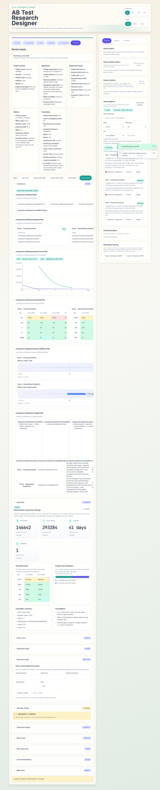
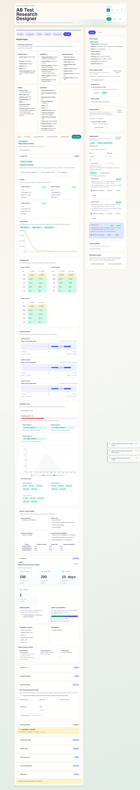

# Multi-project comparison

The comparison view is built for portfolio triage: pick two to five saved experiments and inspect them side by side before spending traffic or engineering time.

## What the dashboard compares

- projected sample size and duration side by side
- power-curve and sensitivity views across saved projects
- observed-effect and forest-style comparison panels
- optional Monte-Carlo distribution overlays for uplift uncertainty and tail risk
- overlapping assumptions, risks, and recommendation highlights
- mixed metric-type selections, with clear caveats when direct effect comparison is not meaningful

## Distribution view

The Distribution view is an opt-in Monte-Carlo overlay for the comparison dashboard. Instead of only showing a single observed uplift per saved project, it samples many plausible uplift outcomes from the observed data and summarizes how often each project stays positive or clears a threshold such as `> 3%`.

This is useful when point estimates look similar but risk is not. Two saved projects can share roughly the same observed uplift while having very different distribution spread, percentile tails, and probability of beating the same target uplift.

Cost note: compute latency is typically around `~200ms per project` for `10k` simulations on the local demo workspace.

## Export and sharing

Comparison selections can be exported through `POST /api/v1/export/comparison` as Markdown or PDF, which makes it easy to move an internal shortlist into a stakeholder update.
