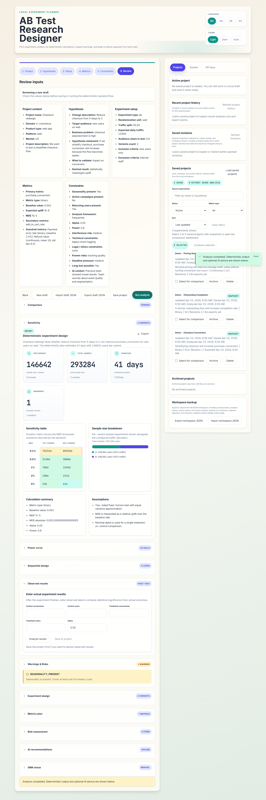

# Results dashboard

The results dashboard combines sizing outputs, design assumptions, warnings, and export-ready guidance in a single view.

## Frequentist outputs

- sample size per variant and total sample size
- effective daily traffic and estimated duration
- absolute MDE derived from the configured relative uplift
- Bonferroni-aware alpha notes for multi-variant designs
- warning blocks for duration, traffic, seasonality, campaigns, and tracking risks

## Bayesian and advanced metrics

- optional Bayesian precision sizing when `analysis_mode=bayesian`
- O'Brien-Fleming sequential boundaries and sample-size inflation when `n_looks > 1`
- CUPED-adjusted scenario for continuous metrics when pre-experiment correlation is provided
- guardrail metrics and report-ready deterministic recommendations

## Export path

From the same backend run you can export markdown, HTML, CSV/XLSX/PDF reports or save the analysis snapshot into project history for later comparison.
