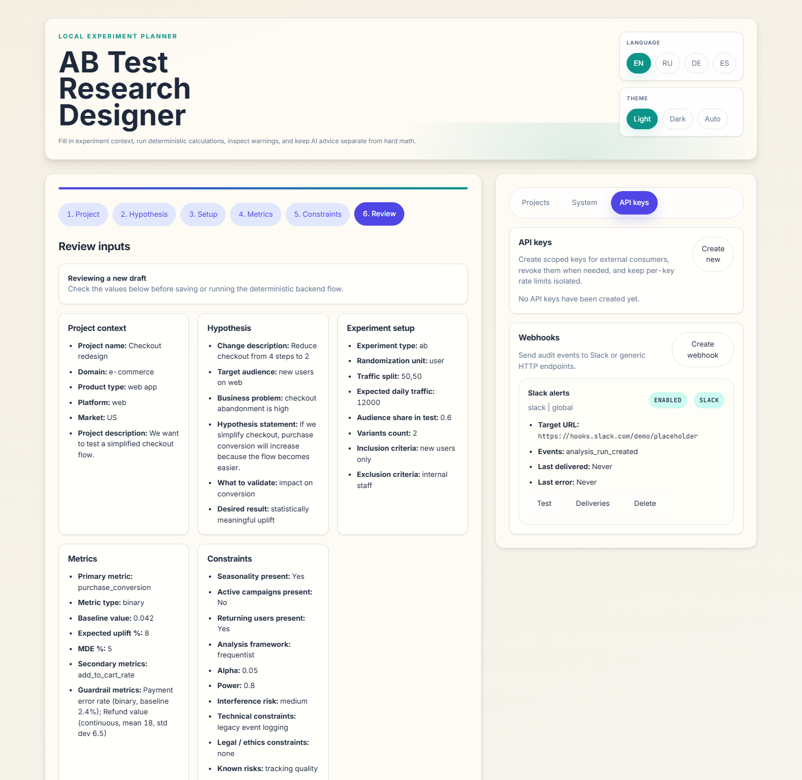

# Webhooks



Webhook subscriptions let the app push operational events out of the local workspace into Slack or any generic HTTPS endpoint.

## Delivery modes

- Generic JSON: outbound payload plus `X-AB-Signature: sha256=...` for HMAC verification.
- Slack: Slack incoming-webhook payload format for lightweight notifications.

## Typical events

- API key lifecycle events
- analysis runs
- workspace import activity
- project archive operations

## Minimal flow

Create a subscription:

```bash
curl -X POST http://127.0.0.1:8008/api/v1/webhooks \
  -H "Authorization: Bearer YOUR_AB_ADMIN_TOKEN" \
  -H "Content-Type: application/json" \
  -d '{"name":"Slack alerts","target_url":"https://hooks.slack.com/services/XXX/YYY/ZZZ","secret":"rotate-me","format":"slack","event_filter":["api_key_created","analysis_run_created","workspace_imported"],"scope":"global"}'
```

Fire a test delivery:

```bash
curl -X POST http://127.0.0.1:8008/api/v1/webhooks/WEBHOOK_ID/test \
  -H "Authorization: Bearer YOUR_AB_ADMIN_TOKEN"
```
