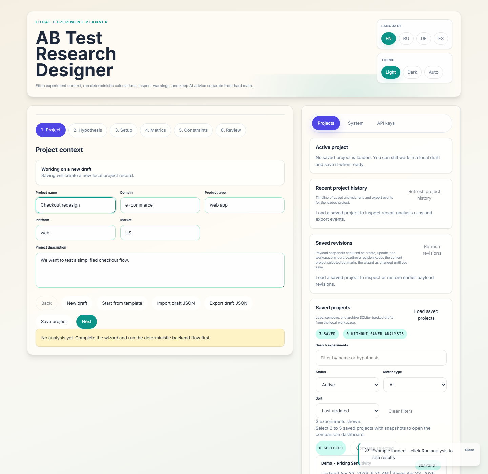
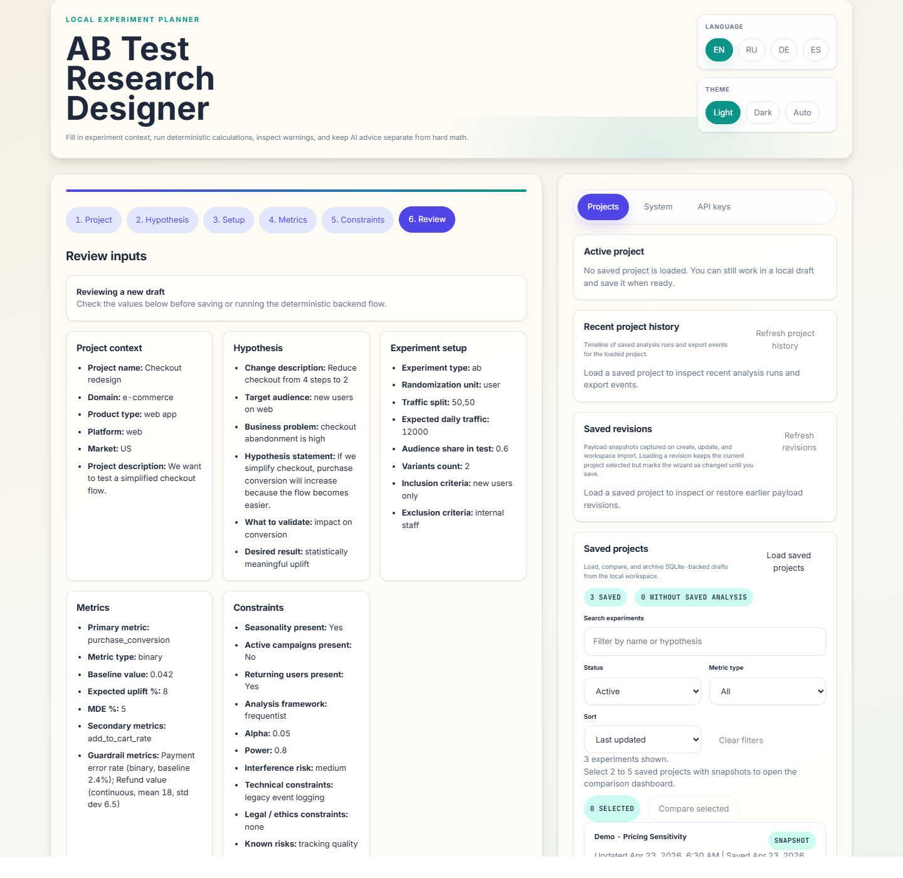

# Wizard flow

The wizard keeps experiment setup, metric design, and delivery constraints in one flow so the same payload can drive calculation, design guidance, reports, and saved-project history.

## Steps in the flow

1. Project context: name, domain, platform, market, and business framing.
2. Hypothesis: change description, audience, expected outcome, and what must be validated.
3. Traffic setup: experiment type, randomization unit, traffic split, daily traffic, and variant count.
4. Metrics: primary metric type, baseline, MDE, alpha, power, optional CUPED inputs, guardrails, and secondary metrics.
5. Constraints: seasonality, campaigns, interference risk, deadline pressure, `n_looks`, and analysis mode.
6. Review: a deterministic summary before the run, with the payload normalized exactly as it will hit the API.

## What makes it practical

- Draft restore and autosave keep the current plan in the browser session.
- JSON import/export lets you move a payload between machines or attach it to a review.
- The same saved payload can later power project history, comparison, exports, and reruns.

## Starter gallery

The wizard now ships with a gallery of 10 built-in presets grouped by category so first-time users can start from a realistic baseline instead of a blank draft.

- Checkout Conversion: revenue-focused checkout flow test for purchase conversion and payment guardrails.
- Feature Adoption: engagement preset for improving discoverability and first-week use of a shipped feature.
- Latency Impact: performance template for measuring how speed changes affect pages-per-session and bounce risk.
- Onboarding Completion: engagement template for reducing first-session drop-off in web onboarding.
- Pricing Sensitivity: revenue preset for pricing or packaging changes with average order value as the primary metric.
- Email Campaign: marketing template for subject-line experiments using email-to-click conversion and deliverability guardrails.
- Push Notification Reactivation: lifecycle template for waking dormant mobile users within a 30-day return window.
- Trial to Paid: SaaS monetization preset for testing trial length against MRR per trial start and ARPU quality.
- Search Ranking CTR: search discovery template for ranking-weight experiments on high-volume SERP click-through.
- App Onboarding Drop-off: mobile activation preset for shortening app onboarding and increasing 24-hour activation.
