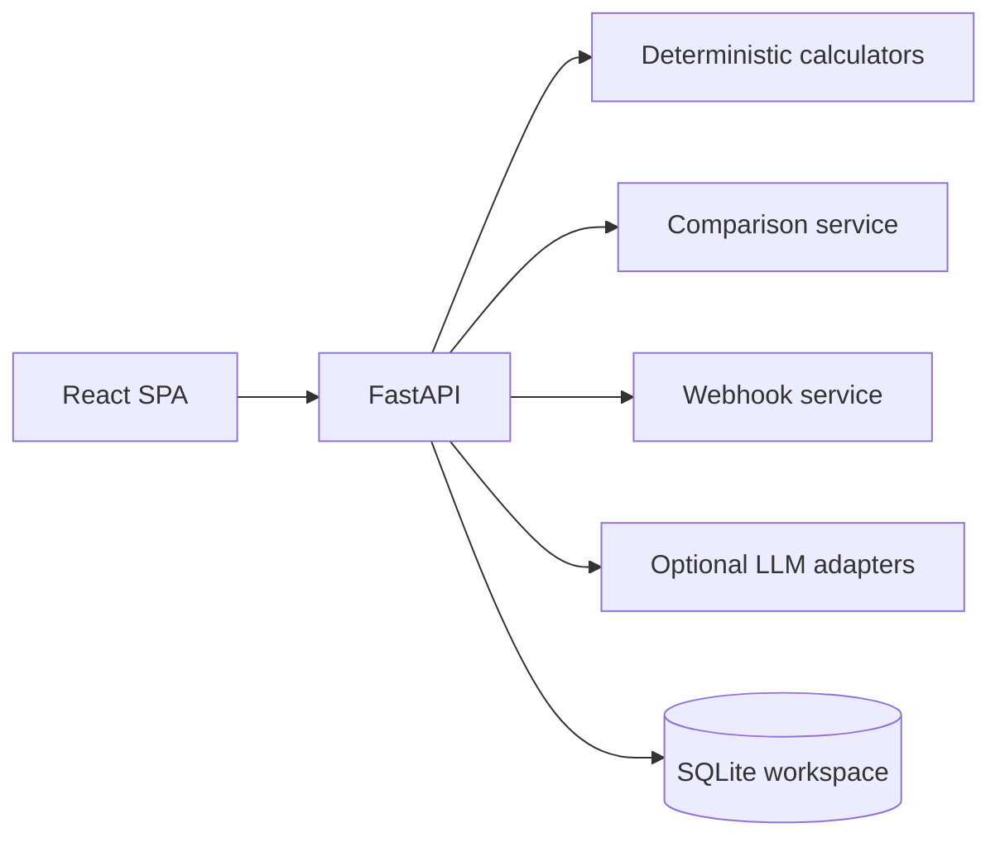

# Architecture

The product is intentionally split so deterministic sizing, optional AI advice, delivery plumbing, and local persistence can evolve independently.

Historical implementation notes and milestone context live in [docs/HISTORY.md](https://github.com/brownjuly2003-code/ab-test-research-designer/blob/main/docs/HISTORY.md).


