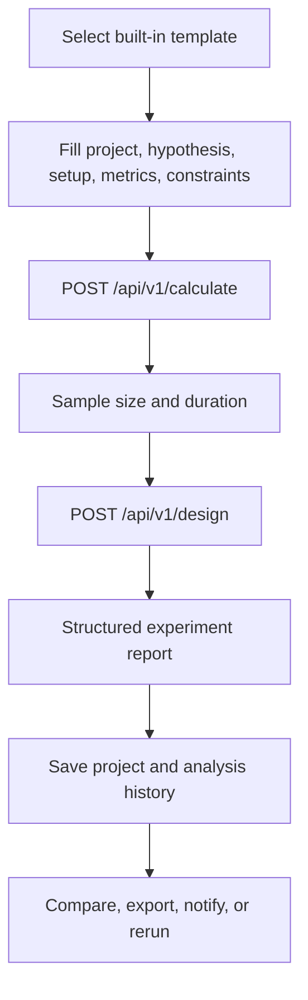

import { Aside, Card, CardGrid } from '@astrojs/starlight/components';

<CardGrid>
  <Card title="Built-in templates" icon="document">
    11
  </Card>
  <Card title="Metric types" icon="puzzle">
    binary, continuous, ratio
  </Card>
  <Card title="Template categories" icon="random">
    9
  </Card>
</CardGrid>

## One Experiment Run

## Built-in Templates

| ID | Name | Category | Metric type | Primary metric | Variants | Source |
| --- | --- | --- | --- | --- | ---: | --- |
| `ad_ctr_ratio` | Feed Ad Click-Through Ratio | Monetization | `ratio` | `ad_ctr` | 2 | `app/backend/templates/ad_ctr_ratio.yaml` |
| `app_onboarding_drop_off` | App Onboarding Drop-off | Mobile Activation | `binary` | `activation_within_24h` | 2 | `app/backend/templates/app_onboarding_drop_off.yaml` |
| `checkout_conversion` | Checkout Conversion | Revenue | `binary` | `purchase_conversion` | 2 | `app/backend/templates/checkout_conversion.yaml` |
| `email_campaign` | Email Campaign | Marketing | `binary` | `email_to_click_rate` | 2 | `app/backend/templates/email_campaign.yaml` |
| `feature_adoption` | Feature Adoption | Engagement | `binary` | `feature_adoption_rate` | 2 | `app/backend/templates/feature_adoption.yaml` |
| `latency_impact` | Latency Impact | Performance | `continuous` | `pages_per_session` | 2 | `app/backend/templates/latency_impact.yaml` |
| `onboarding_completion` | Onboarding Completion | Engagement | `binary` | `onboarding_completion_rate` | 2 | `app/backend/templates/onboarding_completion.yaml` |
| `pricing_sensitivity` | Pricing Sensitivity | Revenue | `continuous` | `avg_order_value` | 2 | `app/backend/templates/pricing_sensitivity.yaml` |
| `push_notification_reactivation` | Push Notification Reactivation | Lifecycle | `binary` | `thirty_day_reactivation_rate` | 2 | `app/backend/templates/push_notification_reactivation.yaml` |
| `search_ranking_ctr` | Search Ranking CTR | Search Discovery | `binary` | `serp_ctr` | 2 | `app/backend/templates/search_ranking_ctr.yaml` |
| `trial_to_paid` | Trial to Paid | SaaS Monetization | `continuous` | `mrr_per_trial_start` | 2 | `app/backend/templates/trial_to_paid.yaml` |

## Registered Statistical Routines

| Module | Public functions | Source |
| --- | --- | --- |
| `always_valid` | `_validate`, `msprt_log_likelihood_ratio`, `always_valid_p_value`, `confidence_sequence`, `evaluate_always_valid`, `default_mixture_variance` | `app/backend/app/stats/always_valid.py` |
| `bayesian` | `bayesian_sample_size_binary`, `bayesian_sample_size_continuous` | `app/backend/app/stats/bayesian.py` |
| `binary` | `normal_ppf`, `standard_normal_cdf`, `wilson_score_interval`, `newcombe_difference_interval`, `calculate_detectable_mde_binary`, `calculate_binary_sample_size` | `app/backend/app/stats/binary.py` |
| `bootstrap_permutation` | `_bounded_probability`, `_percentile`, `bootstrap_permutation_test` | `app/backend/app/stats/bootstrap_permutation.py` |
| `chi_square_independence` | `_validate_contingency_table`, `chi_square_independence_test`, `g_test_independence` | `app/backend/app/stats/chi_square_independence.py` |
| `cluster` | `cluster_design_effect`, `inflate_for_cluster_design` | `app/backend/app/stats/cluster.py` |
| `continuous` | `calculate_cuped_variance_reduction`, `calculate_cuped_theta`, `calculate_detectable_mde_continuous`, `calculate_continuous_sample_size` | `app/backend/app/stats/continuous.py` |
| `cox_ph` | `cox_ph_treatment_effect` | `app/backend/app/stats/cox_ph.py` |
| `cuped` | `dot`, `quadratic_form`, `solve_linear_system`, `cuped_theta`, `adjusted_variance` | `app/backend/app/stats/cuped.py` |
| `duration` | `estimate_experiment_duration_days` | `app/backend/app/stats/duration.py` |
| `equivalence` | `_welch_degrees_of_freedom`, `tost_equivalence_test`, `tost_power`, `calculate_tost_sample_size` | `app/backend/app/stats/equivalence.py` |
| `fisher_exact` | `_log_binomial`, `_hypergeometric_pmf`, `fisher_exact_test`, `fisher_exact_odds_ratio_midp_ci`, `_binomial_logpmf`, `fisher_exact_power`, `_binary_z_sample_size`, `calculate_fisher_exact_sample_size` | `app/backend/app/stats/fisher_exact.py` |
| `guardrail` | `_bounded_probability`, `harm_in_direction`, `worst_status`, `evaluate_guardrail` | `app/backend/app/stats/guardrail.py` |
| `mann_whitney` | `_bounded_probability`, `_exact_two_sided_p`, `_pooled_rank_sum_and_ties`, `_hodges_lehmann_shift`, `mann_whitney_u_test`, `calculate_mann_whitney_sample_size` | `app/backend/app/stats/mann_whitney.py` |
| `multiple_testing` | `_validate`, `benjamini_hochberg`, `holm_bonferroni` | `app/backend/app/stats/multiple_testing.py` |
| `omnibus` | `_bounded_probability`, `_validate_groups`, `welch_anova_test`, `_midranks`, `kruskal_wallis_test` | `app/backend/app/stats/omnibus.py` |
| `paired` | `_bounded_probability`, `_paired_differences`, `paired_t_test`, `_ranks_with_ties`, `_hodges_lehmann_signed`, `wilcoxon_signed_rank_test`, `_mcnemar_exact_two_sided_p`, `mcnemar_test` | `app/backend/app/stats/paired.py` |
| `poisson_rate` | `_bounded_probability`, `_binomial_logpmf`, `poisson_rate_test`, `calculate_poisson_rate_sample_size` | `app/backend/app/stats/poisson_rate.py` |
| `quantile_te` | `_bounded_probability`, `_quantile`, `quantile_treatment_effect_test` | `app/backend/app/stats/quantile_te.py` |
| `ratio` | `_bounded_probability`, `ratio_sufficient_moments`, `ratio_estimate`, `compare_ratios` | `app/backend/app/stats/ratio.py` |
| `sequential` | `_interpolate`, `_interpolate_anchor_by_looks`, `_final_boundary_z`, `obrien_fleming_boundaries`, `sequential_sample_size_inflation` | `app/backend/app/stats/sequential.py` |
| `srm` | `chi_square_srm`, `chi_square_cdf`, `regularized_gamma_p`, `_gamma_series`, `_gamma_continued_fraction` | `app/backend/app/stats/srm.py` |
| `stratification` | `_bounded_probability`, `binary_point_variance`, `continuous_point_variance`, `stratum_difference`, `combine_strata`, `variance_reduction_pct` | `app/backend/app/stats/stratification.py` |
| `student_t` | `_betacf`, `_betainc_regularized`, `t_cdf`, `f_sf`, `t_ppf` | `app/backend/app/stats/student_t.py` |
| `survival` | `_validate_arm`, `kaplan_meier_estimate`, `log_rank_test`, `weighted_k_sample_log_rank_test` | `app/backend/app/stats/survival.py` |
| `trimmed_t` | `_bounded_probability`, `_winsorized_ssd_and_trimmed_mean`, `trimmed_means_t_test` | `app/backend/app/stats/trimmed_t.py` |
| `unconditional_exact` | `_binomial_row`, `_sup_product_binomial`, `_fisher_one_sided_matrices`, `_boschloo_two_sided_p_value`, `_pooled_wald_z`, `_barnard_two_sided_p_value`, `barnard_exact_test`, `boschloo_exact_test` | `app/backend/app/stats/unconditional_exact.py` |

<Aside type="tip" title="Source">
  Generated from <code>{"app/backend/templates/*.yaml"}</code> and <code>{"app/backend/app/stats/*.py"}</code>. The build reads text files only and does not execute Python.
</Aside>
