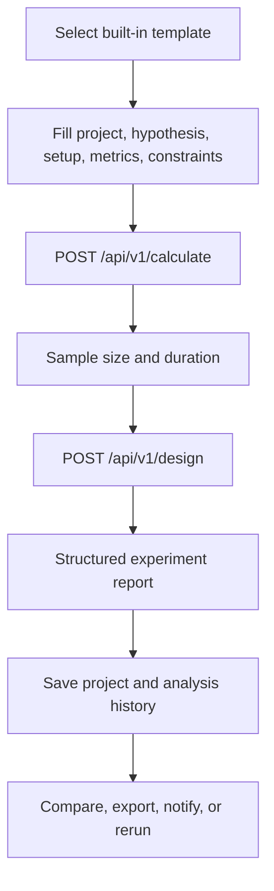

import { Aside, Card, CardGrid } from '@astrojs/starlight/components';

<CardGrid>
  <Card title="Built-in templates" icon="document">
    10
  </Card>
  <Card title="Metric types" icon="puzzle">
    binary, continuous
  </Card>
  <Card title="Template categories" icon="random">
    8
  </Card>
</CardGrid>

## One Experiment Run

## Built-in Templates

| ID | Name | Category | Metric type | Primary metric | Variants | Source |
| --- | --- | --- | --- | --- | ---: | --- |
| `app_onboarding_drop_off` | App Onboarding Drop-off | Mobile Activation | `binary` | `activation_within_24h` | 2 | `app/backend/templates/app_onboarding_drop_off.yaml` |
| `checkout_conversion` | Checkout Conversion | Revenue | `binary` | `purchase_conversion` | 2 | `app/backend/templates/checkout_conversion.yaml` |
| `email_campaign` | Email Campaign | Marketing | `binary` | `email_to_click_rate` | 2 | `app/backend/templates/email_campaign.yaml` |
| `feature_adoption` | Feature Adoption | Engagement | `binary` | `feature_adoption_rate` | 2 | `app/backend/templates/feature_adoption.yaml` |
| `latency_impact` | Latency Impact | Performance | `continuous` | `pages_per_session` | 2 | `app/backend/templates/latency_impact.yaml` |
| `onboarding_completion` | Onboarding Completion | Engagement | `binary` | `onboarding_completion_rate` | 2 | `app/backend/templates/onboarding_completion.yaml` |
| `pricing_sensitivity` | Pricing Sensitivity | Revenue | `continuous` | `avg_order_value` | 2 | `app/backend/templates/pricing_sensitivity.yaml` |
| `push_notification_reactivation` | Push Notification Reactivation | Lifecycle | `binary` | `thirty_day_reactivation_rate` | 2 | `app/backend/templates/push_notification_reactivation.yaml` |
| `search_ranking_ctr` | Search Ranking CTR | Search Discovery | `binary` | `serp_ctr` | 2 | `app/backend/templates/search_ranking_ctr.yaml` |
| `trial_to_paid` | Trial to Paid | SaaS Monetization | `continuous` | `mrr_per_trial_start` | 2 | `app/backend/templates/trial_to_paid.yaml` |

## Registered Statistical Routines

| Module | Public functions | Source |
| --- | --- | --- |
| `bayesian` | `bayesian_sample_size_binary`, `bayesian_sample_size_continuous`, `precision_to_mde_equivalent` | `app/backend/app/stats/bayesian.py` |
| `binary` | `normal_ppf`, `standard_normal_cdf`, `calculate_detectable_mde_binary`, `calculate_binary_sample_size` | `app/backend/app/stats/binary.py` |
| `continuous` | `calculate_cuped_variance_reduction`, `calculate_detectable_mde_continuous`, `calculate_continuous_sample_size` | `app/backend/app/stats/continuous.py` |
| `duration` | `estimate_experiment_duration_days` | `app/backend/app/stats/duration.py` |
| `sequential` | `_interpolate`, `_interpolate_anchor_by_looks`, `_final_boundary_z`, `obrien_fleming_boundaries`, `sequential_sample_size_inflation` | `app/backend/app/stats/sequential.py` |
| `srm` | `chi_square_srm`, `chi_square_cdf`, `regularized_gamma_p`, `_gamma_series`, `_gamma_continued_fraction` | `app/backend/app/stats/srm.py` |
| `student_t` | `_betacf`, `_betainc_regularized`, `t_cdf`, `t_ppf` | `app/backend/app/stats/student_t.py` |

<Aside type="tip" title="Source">
  Generated from <code>{"app/backend/templates/*.yaml"}</code> and <code>{"app/backend/app/stats/*.py"}</code>. The build reads text files only and does not execute Python.
</Aside>
