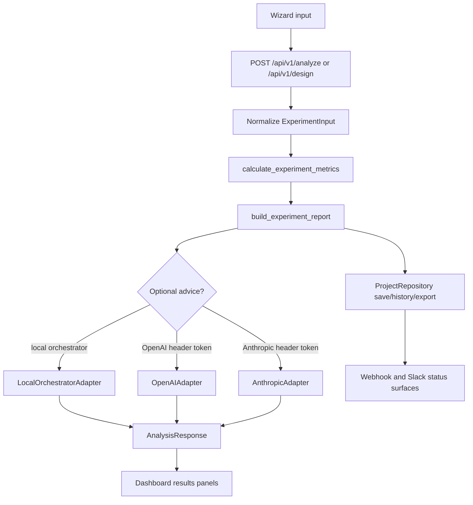

import { Card, CardGrid } from '@astrojs/starlight/components';

AB Test Research Designer is a local-first FastAPI and React application for designing, running, reviewing, and exporting A/B-test plans. The backend owns deterministic calculations and persistence; the frontend owns the wizard, dashboard, and review workflows.

<CardGrid>
  <Card title="Experiment runner" icon="rocket">
    `app/backend/app/routes/analysis.py` converts project inputs into calculation payloads, experiment reports, LLM-advice requests, sensitivity tables, SRM checks, and observed-result analyses.
  </Card>
  <Card title="Stats engine" icon="puzzle">
    `app/backend/app/stats/*` contains binary, continuous, Bayesian, sequential, SRM, duration, and Student-t routines used by services and tests.
  </Card>
  <Card title="Slack notifier" icon="document">
    `app/backend/app/routes/slack.py` and `app/backend/app/slack/*` implement install, OAuth callback, slash command, interactivity, and event endpoints.
  </Card>
  <Card title="Postgres schema" icon="random">
    `ProjectRepository` switches from SQLite to Postgres when `AB_DATABASE_URL` is set, creating project, audit, API-key, webhook, template, Slack, and analysis-history tables.
  </Card>
  <Card title="Dashboard" icon="rocket">
    `app/frontend/src` contains the wizard, comparison dashboard, results panels, project store, draft store, API client, and locale bundles.
  </Card>
</CardGrid>

## Experiment Lifecycle

## Data Stores

| Store | Default | Optional production path | Owned data |
| --- | --- | --- | --- |
| Workspace database | SQLite at `app/backend/data/projects.sqlite3` | Postgres through `AB_DATABASE_URL` | Projects, analysis runs, exports, audit events, templates, API keys, webhooks, Slack installs |
| Frontend build | `app/frontend/dist` | Docker image or external static host | Vite bundle served by FastAPI when `AB_SERVE_FRONTEND_DIST=true` |
| Snapshot dataset | Disabled | Hugging Face Dataset via `AB_HF_SNAPSHOT_REPO` and `AB_HF_TOKEN` | Periodic SQLite backup restore/push loop |
| Generated docs | `docs-site/src/content/docs` | GitHub Pages artifact | Synced markdown, route catalog, experiment catalog, configuration matrix |
