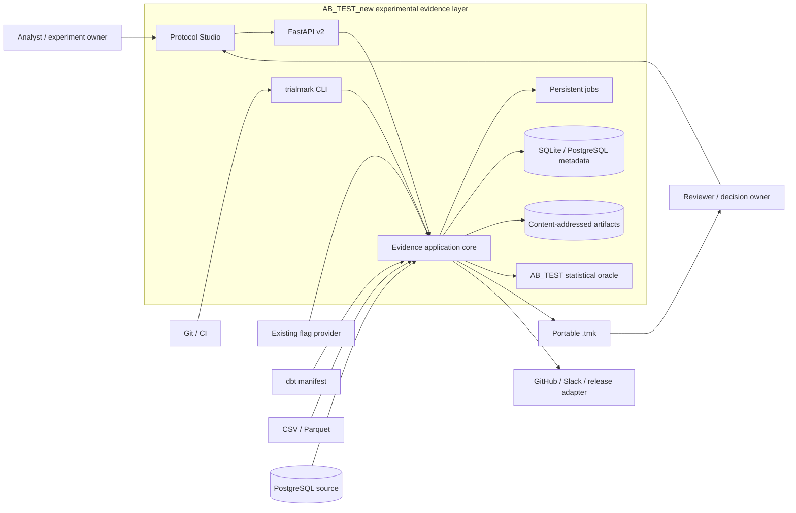
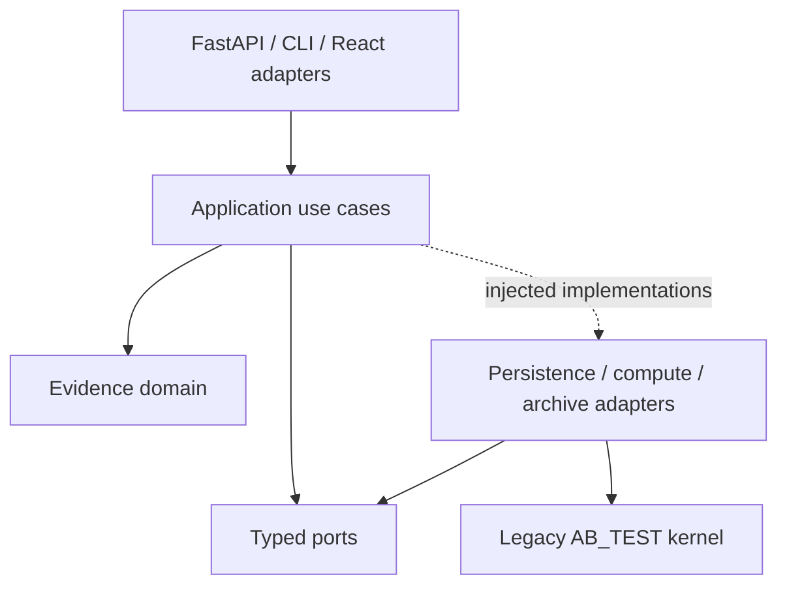
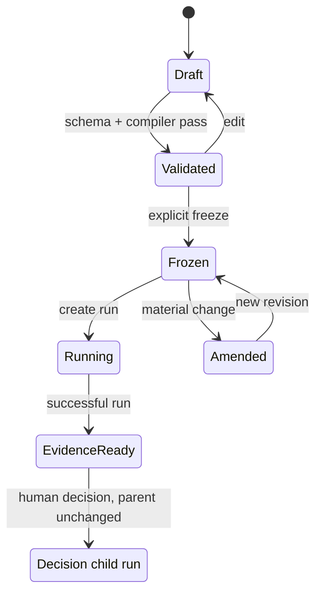
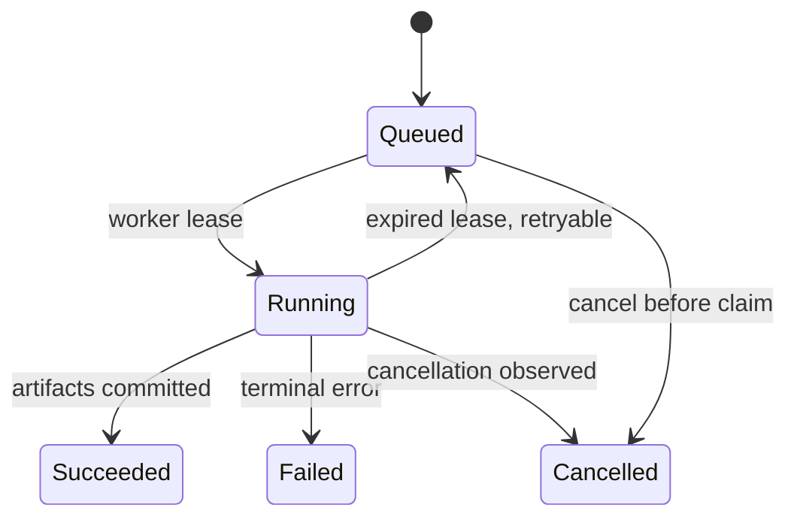

# Experimental evidence layer — target architecture

- Status: Foundation, persisted application and Workbench, statistical
  preflight, sequential design, allocation-aware sizing, independent oracle,
  method profiles, and DSSE decision statements are implemented through phase C.
  External validation remains gated.
- Date: 2026-08-21
- Last updated: 2026-09-01
- Source baseline: AB_TEST commit `02eb881543ec3132a621a1555fce6102bd3462ff`
- Product input: `D:\New_steps\ab.md`, SHA-256
  `622DC1B541158597D88B932A0A92E31BC87D32968081BEB0DC42CDED16A16268`
- Audience: maintainers, data/statistics engineers, security reviewers

## 1. Executive decision

AB_TEST_new keeps the legacy A/B research designer as the statistical
oracle and adds an experimental evidence layer alongside that flow. The
layer becomes a source of truth only after golden conversion and
cross-engine parity pass. It is not a rebrand and not a microservice rewrite.

The persisted application core now realizes this primary aggregate:

1. an immutable-after-freeze `ExperimentProtocolRevision`;
2. an append-only `CompletedEvidenceRun` with typed findings and estimates;
3. a portable `EvidenceBundle` that is tamper-evident on member content
   and schema/reference-verifiable;
4. an append-only human decision represented by a new child
   `CompletedEvidenceRun` and a new bundle; the cited parent run and bundle
   remain unchanged.

`run_protocol`, `record_human_decision`, the portable persisted-run report, and
the user-facing `run` / `decide` / `runs list` CLI are shipped. The persisted
Workbench/API surface (B-06) remains target delivery. The current Workbench
decision endpoint still records demo-session input; it is not the persisted
human-decision path above.

The deployable shape remains a local-first modular monolith:

- one Python application with FastAPI and CLI adapters;
- one React application with URL-addressable evidence workflows;
- SQLite plus filesystem artifact storage locally;
- PostgreSQL plus mounted/object artifact storage in durable deployments;
- DuckDB only as the first local file compute adapter;
- persistent database jobs before any distributed control plane.

This shape preserves the valuable core while removing the architectural causes
of the current product ceiling: overloaded JSON, implicit dependencies,
process-local long jobs and method-first UI.

## 2. Measured baseline

The source specification cited 771 tracked files, and the measured repository
matches that baseline exactly.

| Area | Measured state | Architectural implication |
|---|---:|---|
| Tracked files | 771 | This is a mature codebase; use strangler migration. |
| Python files | 261 | The statistics/runtime asset is substantial. |
| TSX / TS | 132 / 71 | The UI is large enough to require feature boundaries. |
| Backend tests | 87 files | Preserve as scientific and runtime regression oracle. |
| Frontend/E2E tests | 72 files | Keep accessibility and workflow gates. |
| Backend application files | 154 | Avoid another cross-cutting service layer. |
| Frontend `src` files | 224 | Introduce feature surfaces without a full rewrite. |
| Logical database tables | 18 in PostgreSQL | Add evidence tables beside legacy tables first. |
| Source git state | committed baseline plus untracked user files | Clone only committed state; never copy user WIP implicitly. |

### 2.1 Assets to preserve

- pure/stateless functions in `stats/`;
- results dispatch and typed Pydantic contracts;
- assignment, identity, event-time and exclusion semantics;
- SRM, always-valid, sequential, CUPED, stratification and guardrail logic;
- practical decision policy and deterministic decision readout;
- SQLite/PostgreSQL parity work, readiness and audit;
- generated frontend API contracts and strict TypeScript;
- property, accessibility, smoke and browser tests.

### 2.2 Couplings to contain

- `ExperimentInput` carries product description, hypothesis, execution
  configuration, metrics and decision inputs in one mutable document.
- `projects.payload_json` is authoring state, runtime config and compatibility
  envelope at once.
- `routes/analysis.py` composes calculators, simulations, assignment and four
  LLM adapters directly.
- `ProjectRepository` forwards an unbounded API via `__getattr__`.
- legacy persistence mixes schema bootstrap, dialect translation, domain
  queries and migration concerns.
- process-local compute admission protects capacity but cannot resume or
  reliably cancel work after restart.
- global frontend stores combine server state, selection and UI feedback.

These are migration constraints, not reasons to discard the baseline.

## 3. Architectural drivers

### 3.1 Quality attributes

| Attribute | Concrete requirement |
|---|---|
| Scientific correctness | Legacy oracle remains unchanged until parity fixtures pass. |
| Reproducibility | Every estimate resolves to protocol, metric, query, source and runner identities. |
| Integrity | Verifier detects member-content mutation and broken references (tamper-evident on member content; schema/reference-verifiable). |
| Privacy | Aggregate-only typed profile for tested fixtures; no generic path that accepts raw rows. |
| Local-first operation | CSV/Parquet + SQLite path works without cloud or secrets. |
| Portability | Bundle is inspectable without the originating database or UI. |
| Evolvability | Protocol and bundle schemas have explicit compatibility rules. |
| Operability | Long jobs are durable, cancellable, budgeted and diagnosable. |
| Reviewability | Generated SQL, assumptions, findings and overrides are visible. |
| Accessibility | New core user flows retain WCAG 2.1 AA automated gates. |

### 3.2 Goals for the first product gate

- compile a human-authored YAML/JSON protocol into canonical typed JSON;
- freeze a protocol revision before first exposure;
- run protocol completeness, telemetry, and assignment checks against a local
  fixture; Preflight validates externally supplied calibration/power evidence;
- produce a bundle that is tamper-evident on member content and
  schema/reference-verifiable;
- import one legacy project as a protocol draft without inventing provenance;
- expose the same use cases through CLI and HTTP;
- fixture demonstrates blocker remediation and a pre-decision bundle.

### 3.3 Explicit non-goals

- global feature-flag delivery or edge assignment network;
- arbitrary warehouse federation;
- multi-tenant SaaS, billing, Kubernetes or service mesh;
- graph/vector database;
- generic product analytics, session replay or CDP;
- automatic rollout by an LLM;
- changing the statistical formula set during the foundation;
- claiming regulatory compliance from a passing preflight.

## 4. System context



Trust boundaries:

1. protocol and bundle inputs are untrusted documents;
2. source adapters cross into data systems and receive credentials out of band;
3. the stats kernel receives typed aggregates, never connection objects;
4. exported bundles cross the local security boundary;
5. release adapters are outbound and never own the decision.

## 5. Internal architecture

### 5.1 Dependency direction



Rules:

- domain models do not read environment variables or perform I/O;
- application use cases own transaction and state-transition boundaries;
- ports are narrow Protocols, not a generic repository object;
- adapters translate external formats into domain types;
- FastAPI routes validate transport data and call one use case;
- CLI calls the same use cases directly, not localhost HTTP;
- React never implements statistical or gate verdict logic;
- legacy modules cannot import the evidence domain.

### 5.2 Target backend layout

```text
app/backend/app/
  evidence/
    domain/
      protocol.py
      provenance.py
      finding.py
      estimate.py
      decision.py
      bundle.py
      jobs.py
    application/
      compile_protocol.py
      freeze_protocol.py
      run_preflight.py
      build_bundle.py
      verify_bundle.py
      import_legacy.py
      record_decision.py
    ports/
      protocol_store.py
      evidence_store.py
      artifact_store.py
      data_source.py
      stats_kernel.py
      job_store.py
      clock.py
    adapters/
      persistence/
        sqlite.py
        postgres.py
      sources/
        duckdb_files.py
        postgres_readonly.py
        dbt_manifest.py
      kernel/
        legacy_ab_test.py
      archive/
        abx_zip.py
      legacy/
        project_converter.py
    contracts/
      schemas/
      api.py
    cli.py
  routes/
    evidence/
      protocols.py
      preflight.py
      bundles.py
      decisions.py
```

This layout is introduced incrementally. Existing `stats/`, `services/`,
`repository/` and `routes` remain until compatibility gates pass.

### 5.3 Composition

A typed `EvidenceContainer` is created in `main.py` from settings:

- `ProtocolStore`;
- `EvidenceStore`;
- `ArtifactStore`;
- registry of `DataSourceAdapter` implementations;
- `StatsKernel` legacy adapter;
- `JobStore` and worker;
- clock, ID generator and canonicalizer.

Tests construct the same use cases with in-memory/fake ports. Production code
does not locate dependencies through global state or dynamic attribute
forwarding.

## 6. Domain model and invariants

### 6.1 Identity model

| Object | Identity | Mutation rule |
|---|---|---|
| Protocol | stable opaque `protocol_id` | metadata may evolve |
| Protocol revision | `sha256` of canonical protocol JSON plus schema context | immutable after freeze |
| Amendment | opaque ID linking old and new revisions | append-only |
| Source snapshot | declared fingerprint with method and strength | immutable |
| Query artifact | digest of exact UTF-8 SQL + canonical parameters + dialect | immutable |
| Evidence run | UUIDv7/opaque sortable ID | state changes until terminal |
| Finding / estimate | opaque run-scoped ID plus content digest | immutable after run success |
| Artifact | `sha256` of exact bytes | immutable, deduplicated |
| Bundle | digest of canonical manifest core | immutable logical object |
| Decision | opaque ID citing one evidence state | approved records are append-only |

Opaque IDs are used for database references; content digests establish
integrity and equivalence. A digest is never overloaded as a human slug.

### 6.2 Protocol state



Invariants:

- only a validated revision can freeze;
- freeze records canonical digest, actor and UTC timestamp;
- first exposure may reference only a frozen revision;
- material changes after exposure create an amendment and new revision;
- amendment reason and relationship are mandatory;
- no amendment rewrites prior runs or decisions;
- a human decision creates a child run with `parent_run_id`; it never mutates
  the terminal parent run;
- the child decision's `cites_bundle_id` and the child bundle's `supersedes`
  must name the same parent bundle;
- unknown required extension capabilities fail closed.

### 6.3 Protocol v0.1 shape

The authoring document has strict top-level sections:

- `spec_version` and `required_capabilities`;
- `protocol`: ID, title, hypothesis, owners;
- `population`: eligibility, trigger, randomization and analysis population;
- `interventions`: control/treatments, allocation, namespace and hash version;
- `metrics`: versioned primary, secondary and guardrail references;
- `estimand`: population, contrast, effect measure, horizon and missing-data rule;
- `design`: experiment type, interference assumptions and exposure semantics;
- `analysis`: method selection policy, alpha/power, stopping, multiplicity and
  variance reduction;
- `telemetry`: keys, ordering, deduplication, lateness and schema versions;
- `decision`: minimum worthwhile effect, harm rules, owners and approval policy;
- `operations`: rollback owner, lag budget and alert thresholds;
- `extensions`: explicitly namespaced non-core data.

`method: auto` compiles to an explicit versioned `AnalysisPlan`. The compiled
plan, not a mutable UI choice, is what runs and enters the bundle.

Pydantic v2 frozen models are acceptable domain contracts because the project
already depends on Pydantic and needs JSON Schema generation. Models use strict
types, `extra=forbid` and `allow_inf_nan=false`. Cross-field invariants remain
domain validators, not JSON Schema-only rules.

### 6.4 YAML and JSON ingestion

- input size and nesting are bounded before parsing;
- YAML uses a safe loader with duplicate-key rejection and bounded aliases;
- custom YAML tags are forbidden;
- JSON duplicate keys are rejected;
- authoring YAML formatting is never part of protocol identity;
- parsed data validates against the exact schema version offline;
- canonical JSON is generated, then RFC 8785 canonicalized;
- integers outside the interoperable IEEE-754 range are rejected unless the
  schema represents them as strings;
- decimal business values use explicit decimal strings where binary float
  round-tripping would change meaning.

## 7. ABX bundle contract

### 7.1 Logical layout

```text
manifest.json
protocol/
  protocol.json
  protocol.yaml                 # optional authoring source
  amendments.json
run/
  run.json
sources/
  <source-id>.json
metrics/
  <metric-id>.json
queries/
  <query-digest>.sql
diagnostics/
  <finding-id>.json
estimates/
  <estimate-id>.json
decision/
  decision.json                 # optional until a decision exists
rendered/
  report.html                   # optional, no network/script dependency
schemas/
  <schema-name>.schema.json     # archival copies, not trust roots
signatures/
  manifest.dsse.json            # future profile, absent in v0.1
```

### 7.2 Manifest core

```json
{
  "abx_version": "0.1.0",
  "bundle_id": "sha256:<computed>",
  "created_at": "2026-08-21T21:00:00Z",
  "protocol_revision_id": "sha256:<protocol>",
  "run_id": "run_<opaque>",
  "hash_algorithm": "sha256",
  "required_capabilities": ["protocol-core", "lineage-v1"],
  "entries": [
    {
      "path": "protocol/protocol.json",
      "role": "protocol",
      "media_type": "application/json",
      "size": 1234,
      "digest": "sha256:<artifact>"
    }
  ]
}
```

The `bundle_id` hashes the canonical manifest core with `bundle_id` and
`signatures` omitted. The manifest is not self-listed. Entry order is
lexicographic by normalized path.

ZIP timestamps, compression level and host permissions are transport metadata,
not identity. The packer still emits normalized names, stable ordering and
conservative permissions for predictable diffs.

### 7.3 Verifier result

Verification is multi-dimensional:

```json
{
  "integrity": "pass",
  "schema_conformance": "pass",
  "reference_integrity": "pass",
  "lineage": "partial",
  "privacy_policy": "pass",
  "signature": "not_present",
  "statistical_validity": "not_asserted"
}
```

A single green badge would conflate unrelated guarantees. CLI exit status is
non-zero for integrity, schema, reference or mandatory privacy failure. Partial
lineage is a warning for imported legacy evidence and a blocker for newly
generated final evidence.

The verifier result also includes `unbound_bindings`. That key lists metric
artifact paths in binding states `absent`, `ambiguous`, and `unlocated`. It
does not list every metric whose definition failed to bind.

- `absent`: the bundle carries no embedded definition payload. The path is
  listed and accepted — missing content is reported, not a failure.
- `ambiguous` and `unlocated`: the path is listed and rejected as
  `lineage/unbound_reference`.
- `present` with a digest that does not match: rejected as
  `lineage/unbound_reference` and deliberately omitted from
  `unbound_bindings`.
- `present` with a matching digest: the definition is bound; the path is
  accepted and not listed.
- `null` / `not_checked`: lineage and reference binding were not evaluated
  (for example after an integrity failure).

An empty `unbound_bindings` list therefore does not mean every definition is
bound.

### 7.4 Archive safety

Initial policy defaults:

- at most 512 members;
- at most 64 MiB total uncompressed and 16 MiB per member;
- reject suspicious compression ratios above a configurable ceiling;
- no absolute, drive-prefixed, UNC, empty, dot or parent paths;
- directory entries (filename trailing `/`) fail as `unsafe_member_path`;
- central-directory entry-type metadata (`external_attr`, ZIP file-type bits)
  is unauthenticated and is not a basis for rejection; consumers extracting
  with a third-party unzip must not honour those bits;
- reject names colliding after Unicode NFC + case-fold normalization;
- fixed allowlist of root roles;
- stream and hash without extracting;
- never resolve remote schema URLs during verification.

Python documentation explicitly warns that untrusted ZIP members can create
files outside the intended path and that ZIP bombs can exhaust resources.
ABX therefore does not call blind `extractall`.

The physical-layout scan (`_stored_offsets_match_physical_layout`)
authenticates the stored central-directory offset when it can locate one
(`_stored_central_directory_offset`): the Zip64 EOCD CD offset if a
well-formed Zip64 trailer is present, otherwise classic EOCD bytes 16–20.
A mismatch is `archive_trailing_bytes`. Trailer re-comparison of that same
field is not the authenticator. When no stored offset can be located the
scan is vacuously true and the archive is rejected by the surrounding
EOCD/trailing-byte checks instead.

All three trailer offset comparisons are verdict-neutral. Whenever
`_stored_offsets_match_physical_layout` fails, `_archive_preflight` has
already appended `archive_trailing_bytes` and `verify_bundle` returns on
any preflight error, so gating or un-gating changes only which fields are
named in the diagnostics.

The `stored_offsets_trusted` gate on classic EOCD bytes 16–20 never
suppresses the only check on that field. It skips the comparison exactly
when the layout scan has already failed and recorded its own error.
When a well-formed Zip64 trailer is present the scan validates the Zip64
EOCD CD offset instead, `stored_offsets_trusted` stays True, and the
classic comparison still runs — pinned by
`test_forged_classic_eocd_cd_offset_on_zip64_archive_is_rejected`, which
asserts `_layout_trusted()` is True and still rejects the forgery.

The Zip64 locator's EOCD offset (locator bytes 8–16) is a different field.
The comparison is un-gated. That changes diagnostics only, never the
verdict: whenever the trusted-layout gate would have suppressed it,
`_stored_offsets_match_physical_layout` has already failed and
`verify_bundle` returns on the preflight `archive_trailing_bytes` error.
The scan never reads locator bytes 8–16 in any case, so the gate would
suppress the only diagnostic naming that field precisely when the scan
fails — that is why it is un-gated. Locator bytes 8–16 are reported by
no other check, so the extra message names a field that would otherwise
go unmentioned. A Zip64 archive whose offsets are relative to a prefix
therefore also collects `archive central directory has no end record`.
That extra message is a diagnostic-quality cost on an already-failing
input, not a false reject. The field-coverage argument used for the
locator does not by itself distinguish the two fields: with Zip64 present
the scan does not read classic bytes 16–20 either. The asymmetry is
diagnostic coverage, not security value.

### 7.5 Aggregate-only typed profile for tested fixtures

Bundle producers serialize only typed artifact models. There is no API such as
`add_directory` or `add_arbitrary_file` in the application port. This is an
aggregate-only typed profile for tested fixtures, not a scanner-proof privacy
guarantee.

Forbidden content:

- user-level event rows;
- direct identifiers or small-cell drill-downs;
- passwords, tokens, cookies and private keys;
- raw DSNs or connection strings;
- LLM prompts/results containing customer data;
- absolute local paths.

Source artifacts contain opaque local `source_ref`, schema metadata, snapshot
fingerprint and redacted engine information. Secret/PII scanning is a defense
in depth gate, not the primary privacy boundary.

## 8. Data and compute plane

### 8.1 DataSourceAdapter

```python
class DataSourceAdapter(Protocol):
    def inspect(self, source: SourceRef) -> SourceContract: ...
    def fingerprint(self, source: SourceRef) -> SourceFingerprint: ...
    def plan(self, request: AggregateRequest) -> QueryPlan: ...
    def estimate(self, plan: QueryPlan) -> CostEstimate: ...
    def execute(
        self,
        plan: QueryPlan,
        budget: ExecutionBudget,
        cancellation: CancellationToken,
    ) -> AggregateResult: ...
```

The port returns bounded aggregate rows and execution metadata. It never
returns a database connection or an unbounded dataframe to application code.

`AggregateRequest` is a typed query intent produced by the protocol compiler.
Adapters may render dialect-specific SQL, but the reviewed SQL and canonical
parameters are captured before execution.

### 8.2 DuckDB files adapter

Purpose: local CSV/Parquet fixtures and pilot data.

- process-local DuckDB connection per job;
- read-only file allowlist rooted in an explicitly selected directory;
- no arbitrary URL or extension repository access during a run;
- bundled/pinned `parquet` support;
- statement timeout/cancellation and memory/temp-space limits;
- stable timezone, NULL and identifier semantics captured in runner metadata.

DuckDB documents Parquet as a primary core extension. Its PostgreSQL extension
also supports writes and is secondary-support. This design therefore does not
use that extension as its v0.1 PostgreSQL boundary.

### 8.3 PostgreSQL source adapter

- existing `psycopg` stack;
- dedicated read-only database role;
- `READ ONLY` transaction, `statement_timeout` and lock timeout;
- parameterized values and validated identifiers;
- one compiled query plan per artifact;
- server-side aggregation; raw rows do not cross the adapter;
- source fingerprint includes server version, database/schema identity
  without credentials, snapshot method and query time.

SQL parsing is not treated as a security boundary. Database permissions and
read-only transactions remain authoritative.

### 8.4 dbt manifest adapter

**Reserved for phase G, not shipped.** `dbt_manifest.py` lives in
`app/backend/app/evidence/reserved/` with its pinned `dbt/manifest/v12.json`,
is excluded from the wheel, and has no importer in the running application.
Its tests stay in the gate so it remains revivable. What follows is the design
it is kept for, not behaviour the product has.

The importer:

- reads `metadata.dbt_schema_version` and validates the matching official
  artifact schema;
- currently supports manifest v12 explicitly, with adapters for older
  supported versions rather than field guessing;
- records `unique_id`, package, path, owner, dependencies and metric semantics;
- hashes the exact manifest and relevant selected node;
- never imports absolute `root_path` into ABX;
- does not become a semantic-metric editor.

Official dbt docs distinguish dbt and manifest versions and list v12 for
current Core/Fusion versions. The version is therefore a required contract,
not incidental metadata.

### 8.5 StatsKernel adapter

The initial adapter maps compiled `AnalysisPlan` and typed sufficient
statistics to existing AB_TEST functions. It records:

- kernel semantic version and git commit;
- analyzer and policy version;
- numeric tolerance and random seed where applicable;
- dependency-lock digest;
- input aggregate digests;
- output estimate and diagnostic digests.

No new method is added in the same slice as the adapter. Parity failures stop
migration rather than being normalized away.

## 9. Persistence architecture

### 9.1 Relational metadata

New tables are separate from legacy tables:

| Table | Key fields and role |
|---|---|
| `protocols` | stable identity, slug, current draft, timestamps |
| `protocol_revisions` | canonical JSON, digest, schema version, state, parent, freeze metadata |
| `protocol_amendments` | from/to revisions, reason, actor, approval |
| `metric_references` | protocol revision, role, external ref/version/digest |
| `source_snapshots` | kind, redacted identity, fingerprint, strength |
| `evidence_jobs` | kind, state, lease, heartbeat, cancellation, budget, error |
| `evidence_runs` | protocol revision, job, kind, status, runner digest, times |
| `query_artifacts` | run, source snapshot, dialect, SQL/parameter digests |
| `validity_findings` | run, code, severity, state, evidence, remediation |
| `finding_overrides` | finding, actor, reason, policy, timestamp |
| `estimates` | run, metric, estimand, value/uncertainty, lineage digest |
| `decisions` | cited run, policy, proposed/human verdict, rationale, state |
| `decision_approvals` | decision, role, actor, verdict, timestamp |
| `evidence_artifacts` | digest, media type, size, storage key |
| `run_artifacts` | run-to-artifact role mapping |
| `bundle_exports` | bundle ID, manifest digest, run, timestamp |
| `legacy_project_links` | legacy project/run to protocol/run mapping |
| `evidence_edges` | later graph relation with typed endpoints |

The existing `analysis_runs` name is already occupied by a legacy JSON
snapshot table. The new table is deliberately `evidence_runs`; renaming legacy
history during foundation would create needless migration risk.

The shipped B-03 storage profile is narrower than the full target table set:
`evidence_runs`, `evidence_run_capabilities`, `evidence_artifacts`, and
`run_artifacts` persist each `CompletedEvidenceRun`. A human decision is a
typed decision artifact in a child run, with the parent relationship bound in
the run artifact. The separate `decisions`, `decision_approvals`, and
`evidence_edges` rows above remain target storage for later services.

### 9.2 Append-only meaning

The application exposes no update/delete operation for frozen revisions,
terminal runs, findings, estimates or approved decisions. Database constraints
protect state values and references; content digests reveal out-of-band
tampering.

This is tamper-evident, not tamper-proof. A database administrator can alter
storage. External ABX copies and later public-key signatures provide stronger
independent evidence.

### 9.3 Artifact store

Structured metadata stays relational. Artifact bytes use a
content-addressed store:

```text
data/evidence/sha256/ab/abcdef...
```

Writes go to a same-volume temporary file, are hashed, fsynced where supported
and atomically renamed. The database reference is committed only after the
artifact exists. Orphan cleanup is mark-and-sweep and never deletes a digest
referenced by a non-terminal or terminal run.

Local mode uses this directory beside SQLite. Durable container mode mounts it
separately. An object-storage adapter is a later transport implementation, not
a domain change.

### 9.4 Migrations

Legacy migrations remain untouched. New evidence migrations use a durable
ledger on both engines:

- SQLite claims migration with `BEGIN IMMEDIATE`;
- PostgreSQL uses the existing advisory-lock pattern;
- each numbered migration has explicit SQLite and PostgreSQL SQL;
- shipped migrations are immutable;
- fresh-install and upgrade-path tests must converge on the same schema.

Adding SQLAlchemy/Alembic solely for this module is deferred; it would expand
the runtime before demonstrating a missing capability.

### 9.5 Known limitations, not defects

Three costs are linear in the number of persisted runs and are accepted while
there are three of them. They are recorded here so the next person meets them
as decisions rather than as surprises, and they are deliberately not optimised:
there are no users yet, and tuning against no load produces the wrong shape.

| Behaviour | Measured | Where it bites |
|---|---|---|
| `GET /api/v2/runs/{id}:bundle` repacks the archive on every request instead of serving the persisted bytes | 438 ms per GET | Every download, growing with bundle size |
| `list_runs` loads each run in full to build its summary; no pagination | -- | `GET /api/v2/runs` at a few hundred runs |
| Seeding three ASOS demo runs at startup | 83 s in test | Every cold start of the demo workspace |

At three runs none of this is visible. At three hundred all of it is. The
trigger for fixing any of them is a real user waiting on it, not this table.

## 10. Persistent job lifecycle



Job invariants:

- idempotency key prevents duplicate logical jobs;
- claim has owner, lease expiry and heartbeat;
- cancellation is cooperative and checked between bounded stages;
- budget records wall time, memory, scan estimate and output limit;
- only a succeeded run can be bundled as final evidence;
- staging artifacts are invisible until the run transaction commits;
- retry creates another attempt record but preserves the logical job identity;
- the API never waits for long work inside a request worker.

First deployment runs one worker in the application process. PostgreSQL
multi-worker claim semantics can later use row locking. Redis/Celery is not
introduced until measured concurrency requires it.

## 11. Application use cases

| Use case | Input | Atomic outcome |
|---|---|---|
| `compile_protocol` | YAML/JSON bytes | canonical draft + compiler findings |
| `freeze_protocol` | validated revision + actor | immutable revision |
| `import_legacy` | project ID/revision | draft + explicit gap findings |
| `start_preflight` | frozen/draft revision + source refs | durable job |
| `run_preflight` | claimed job | terminal run or failure |
| `build_bundle` | terminal run | manifest and ABX artifact |
| `verify_bundle` | stream + policy | multi-dimensional verdict |
| `record_override` | finding + actor + reason | append-only override |
| `record_human_decision` | parent analysis run ID + principal + human verdict/rationale | append-only child `CompletedEvidenceRun` and superseding bundle |

Each command returns a typed result and domain error codes. Audit events are
written in the same metadata transaction through an explicit `AuditPort`.
Outbound webhook/release notification is queued after commit.

## 12. API and CLI

### 12.1 HTTP v2

Legacy `/api/v1` remains compatibility-only. New contracts use `/api/v2`.

**Implemented in B-06** (`app/backend/app/routes/workbench.py`):

| Method | Path | Result |
|---|---|---|
| GET | `/api/v2/runs` | persisted run portfolio |
| GET | `/api/v2/runs/{run_id}` | persisted run detail |
| GET | `/api/v2/runs/{run_id}:bundle` | download the persisted `.tmk` |
| POST | `/api/v2/runs/{run_id}/decisions` | create an append-only decision child run |
| POST | `/api/v2/runs/{run_id}/findings/{finding_id}:remediate` | create a remediated child run |
| POST | `/api/v2/runs/{run_id}/findings/{finding_id}:override` | create a formal-override child run |

The eight demo-session routes (`/api/v2/workbench*`, `/api/v2/bundles:verify`,
and `/api/v2/decisions`) and `WorkbenchService` were removed in B-06.
There is no `/api/v2/protocols*` router.

**Target architecture — not implemented in the current supported surface:**

| Method | Path | Result |
|---|---|---|
| POST | `/api/v2/protocols:compile` | draft + findings |
| POST | `/api/v2/protocols` | persisted draft |
| POST | `/api/v2/protocols/{id}/revisions/{rev}:freeze` | frozen revision |
| POST | `/api/v2/preflight-jobs` | `202` + job resource |
| GET | `/api/v2/jobs/{id}` | state/progress/budget |
| POST | `/api/v2/jobs/{id}:cancel` | cancellation requested |
| GET | `/api/v2/evidence-runs/{id}` | findings/estimates/lineage |
| POST | `/api/v2/evidence-runs/{id}:bundle` | bundle export resource |

The current phase-B delivery names in the plan (`/api/v2/runs`, CLI `run` /
`decide`) do not include the rows above; those rows remain the target
architecture, not a claim about today's code. The phase-B analogues of the
last two rows are B-06's `/api/v2/runs/{run_id}` and
`/api/v2/runs/{run_id}:bundle`; the paths above are the target names, not
the scheduled ones.

Target architecture: commands will use `Idempotency-Key` where retries can
create state, and optimistic concurrency will use revision identity, not
last-write-wins timestamps; the implemented v2 routes accept no
`Idempotency-Key` header today.

### 12.2 CLI

**Implemented now** (`app/backend/app/evidence/cli.py`; prog name
`trialmark`), after `pip install -e . --no-deps`:

```text
trialmark pack <source-dir> --out result.tmk
trialmark pack --run <run-id> --artifact-root <root> --out result.tmk
trialmark verify result.tmk --offline --policy strict
trialmark inspect result.tmk --format summary
trialmark run --protocol protocol.yaml --source source.parquet --out analysis.tmk
trialmark run --protocol pilot.yaml --source aggregate.csv --out pilot.tmk
trialmark decide --run <run-id> --verdict ship --rationale "..." --out decision.tmk
trialmark runs list
trialmark pilot-session create --participant-ref anon_<16 hex> --source-ready-at <ts> --outcome completed|incomplete [--bundle <tmk> --bundle-ready-at <ts>] [--reuse-kind second_run|evidence_reopen --reuse-at <ts>] --out <date>-<ref>.md
trialmark pilot-session validate <record.md>
trialmark source validate --protocol protocol.yaml --source aggregate.csv
trialmark gate3 --records docs/pilots [--out gate3.md]
```

`run` selects its source profile from the single `extensions` key the protocol
declares: `trialmark.asos` reads an aggregate ASOS Parquet source,
`trialmark.aggregate-binary` reads a one-row aggregate CSV
(`control_users,control_conversions,treatment_users,treatment_conversions`) for
external pilots. Declaring neither or both is an error. `pilot-session` writes
and validates the anonymous record of one observed external session; it reads
the published bundle for its census and accepts no source path and no identity.
`source validate` runs the source half of `run` and stops there -- no database,
no run, no bundle, no writes -- so a practitioner's CSV can be checked before a
session rather than during one. `gate3` aggregates validated pilot records into
the Gate 3 decision and exits 0 whatever it decides, because `stop` is a
measurement rather than a command failure.

Without the editable install, substitute
`python -m app.backend.app.evidence.cli` for `trialmark` — that is the
form the gate uses.

`verify --offline` is always enforced (no DNS, schema download, or source
reconnection). `pack` / `verify` / `inspect` / `run` / `decide` print JSON on
stdout; `inspect --format summary` is a human-readable alternative. `run` and
`decide` report the published `run_id`, `bundle_id`, and verifier verdicts.
`runs list` returns those fields for every persisted run. Exit status is 0 when
the command succeeds and, for bundle commands, the result is `valid`; otherwise
it is 1. Argument parsing errors use status 2.

Persisted commands use the application database configuration. Artifact
payloads default to `.trialmark/artifacts`; `--artifact-root` overrides that
location and must remain consistent between `run`, `decide`, and `runs list`.
Principal resolution is `--actor`, then `$USER`, then `local-operator`.

**Target architecture — not implemented in the current supported surface.**
These separate protocol-authoring and legacy-import
subcommands remain absent from `cli.py`:

```text
trialmark protocol validate protocol.yaml
trialmark protocol compile protocol.yaml --out protocol.json
trialmark preflight run protocol.yaml --source local-fixture
trialmark legacy import-project <project-id>
```

Phase B shipped `trialmark run` / `trialmark decide` / `trialmark runs list`
in B-05 and does not include the commands above. The commands above are the
target architecture, not shipped commands.

## 13. Frontend architecture

### 13.1 Route surfaces

- `/portfolio` — questions, protocol state, blockers and pending review;
- `/protocols/new` and `/protocols/:id` — Protocol Studio;
- `/protocols/:id/preflight` — gates, evidence and remediation;
- `/evidence/:runId` — Evidence Review and lineage drill-down;
- `/decisions/:id` — human decision/approval;
- `/legacy/*` — inherited wizard and result tools during migration;
- `/atlas` — reserved and unavailable before its product gate.

### 13.2 Feature boundaries

```text
app/frontend/src/
  app/                 # shell, routing, providers
  features/
    protocol/
    preflight/
    evidence/
    decision/
    portfolio/
    legacy/
  entities/            # generated/domain projections
  shared/
    api/
    ui/
    i18n/
    accessibility/
```

State rules:

- server resources and job polling are server state;
- unsaved protocol editing is draft state;
- theme/language are preference state;
- selected tabs and dialogs are view state;
- deterministic verdicts arrive from backend contracts;
- displayed claims carry clickable evidence IDs.

The implementation may introduce a query-cache/router library in a dedicated
slice after measuring the current abstractions. The architecture requires the
separation, not a particular npm dependency.

### 13.3 Primary Preflight view

The first new UI is intentionally one flow:

1. protocol identity and freeze status;
2. blockers first, then warnings and passed gates;
3. each finding shows evidence, scope, remediation and assumptions;
4. an override requires actor, reason and policy permission;
5. generated SQL and source fingerprint are reviewable;
6. job progress and cancel action survive navigation;
7. successful run exposes `Download .tmk` and `Verify` actions.

No aggregate “trust score” hides individual failures.

## 14. Security and privacy model

| Threat | Primary control | Verification |
|---|---|---|
| ZIP path traversal / bomb | stream-only verifier, path and resource limits | malicious archive fixtures |
| YAML alias/duplicate-key ambiguity | bounded safe parser, duplicate rejection | parser adversarial tests |
| Artifact tampering | per-entry digest + manifest bundle ID | mutation property tests |
| Weak/forged provenance | declared fingerprint method/strength | lineage policy tests |
| SQL injection or writes | compiled intent, read-only role/transaction | DB permission tests |
| Secret/PII in bundle | typed allowlisted artifacts + scanner | seeded leak fixtures |
| HTML active content | escaped rendering, no scripts/network, restrictive CSP | browser/security tests |
| Remote schema substitution | trusted offline schema registry | network-disabled verify test |
| AI claim hallucination | evidence citations and deterministic verdict | golden answer tests, later |
| Unauthorized decision | explicit actor/role and approval policy | authorization/audit tests |
| Job resource exhaustion | admission + durable budgets + cancellation | timeout/memory/output tests |

Connection credentials are runtime configuration and never protocol fields.
Bundle verification does not reconnect to sources. Logs use IDs and redacted
locators; prompts and row data are telemetry-off by default.

## 15. Observability

Structured events:

- protocol compile/freeze/amend;
- job queued/claimed/heartbeat/cancelled/failed/succeeded;
- source inspected/fingerprinted;
- query planned/executed with budget and row/byte aggregate counts;
- finding emitted/overridden;
- bundle built/verified;
- decision proposed/recorded/approved.

Metrics:

- job queue depth and oldest age;
- duration by stage/adapter;
- cancellation latency and lease recovery;
- verifier failures by dimension;
- lineage completeness;
- bundle sizes and artifact dedup ratio;
- preflight failure class and false-blocking review outcomes.

Raw SQL may be stored as a protected artifact but logs carry only query digest.
No metric labels contain project names, user IDs or source credentials.

## 16. Compatibility migration

### 16.1 Legacy converter mapping

**Reserved for phase G, not shipped.** `legacy.py` lives in
`app/backend/app/evidence/reserved/`, is excluded from the wheel, and has no
importer in the running application; `trialmark legacy import-project` is not
a shipped command. The table below is the mapping the converter implements,
kept because recovering it costs more than keeping it.

| Legacy source | Evidence-layer target | Rule |
|---|---|---|
| `project/hypothesis` | protocol metadata/hypothesis | direct draft mapping |
| `setup` | population/design/interventions | map known fields; emit missing trigger/owner findings |
| `metrics` | metric refs + estimand draft | local inline ref marked unversioned |
| `constraints` | analysis/decision/operations draft | do not infer absent approval policy |
| `analysis_runs.analysis_json` | imported evidence run | `lineage=partial`, never claim query/source provenance |
| exposure/conversion tables | legacy source adapter | aggregate in place; never export rows |
| decision readout | proposed decision evidence | human decision remains absent unless recorded |

A legacy project imports only to Draft. Missing metric version, source snapshot,
trigger, owner or stopping semantics appear as compiler findings; the converter
does not silently invent them.

### 16.2 Strangler order

1. schemas and offline verifier;
2. legacy converter and golden round-trip;
3. typed persistence plus persistent jobs;
4. DuckDB and PostgreSQL source adapters;
5. preflight gates;
6. Workbench surface;
7. evidence projection on legacy results page;
8. new protocol as source of truth;
9. legacy creation path becomes read-only;
10. removal only after an explicit deprecation window.

At no step are math, storage model and main UI replaced simultaneously.

## 17. Verification strategy

### 17.1 Contract tests

- JSON Schema valid/invalid fixtures for every artifact version;
- generated OpenAPI → frontend type drift gate;
- compiler error-code stability;
- backward-compatibility corpus for supported minor versions.

### 17.2 Integrity and property tests

- RFC 8785 conformance vectors;
- pack → verify round-trip;
- arbitrary one-byte mutation detection;
- path normalization, duplicate names and ZIP bomb limits;
- missing/unlisted artifact and broken-reference rejection;
- bundle identity independent of ZIP compression metadata.

### 17.3 Scientific and data parity

- existing AB_TEST stats suite remains unchanged;
- legacy adapter result equals direct kernel result;
- DuckDB/PostgreSQL golden fixtures agree within per-estimator tolerance;
- explicit timezone, NULL, late-event and identity fixtures;
- seeded stochastic methods record seed and remain deterministic.

### 17.4 Privacy and security

- secret, DSN, email/user ID and small-cell leak fixtures;
- database role cannot execute writes;
- offline verifier succeeds with network disabled;
- malicious YAML/JSON/ZIP corpus;
- HTML report CSP and escaping checks.

### 17.5 Workflow acceptance

**Current control path.** The three committed ASOS Digital Experiments
`.tmk` bundles (`d53f0e`, `26bd38`, `834947` under
`app/backend/tests/fixtures/evidence/asos/bundles/`) pass `verify_bundle`
with `valid=true`, `integrity=pass`, and `lineage=pass`. They are the
reference that a successful verify still exists. Tests of a successful
Workbench upload/decide path use those archives, not the demo fixture.

**Removed in B-06 — Workbench demo fixture.** The former in-memory session,
its injected blocker constants, placeholder-lineage archive, eight HTTP routes,
and fixture-specific test suite were legacy. The successful Workbench path now
uses persisted ASOS runs and content-bound bundles only.

**Implemented now — persisted application core (B-02/B-03).**
`run_protocol(FrozenProtocol, source, *, principal, out_store)` reads the
aggregate source — ASOS Parquet, or the external-pilot CSV of
`binary_aggregate.py` — through the constrained DuckDB adapter, applies typed
protocol/telemetry/assignment preflight, runs the real StatsKernel adapter
when no blocker remains, and persists a `CompletedEvidenceRun` with
content-bound ABX artifacts. Its published bundle passes integrity and
lineage verification.

`record_human_decision(run_id, principal, verdict, rationale, *, out_store)`
creates an immutable child run instead of updating the analysis run. The
decision cites the verified parent `bundle_id`; the child manifest publishes
that ID as `supersedes`. The verifier requires a consistent
`parent_run_id` ↔ `cites_bundle_id` ↔ `supersedes` chain. Repeating a decision
against the same parent creates another distinct child and leaves the parent
byte-identical.

**Implemented now — portable persisted-run report (B-04).** Analysis runs,
blocked preflight runs, and human-decision child runs include deterministic,
self-contained `rendered/report.html` built from their immutable artifacts.
The renderer handles multiple estimates, escapes document values, and keeps a
locked-down offline CSP. Decision children regenerate the report after artifact
rebinding instead of inheriting their parent's bytes.

**Implemented now — persisted-run CLI (B-05).** `trialmark run` loads and freezes
a YAML protocol, executes the supported aggregate Parquet source, persists the
completed run through the application repository, and publishes a verified
`.tmk`. `trialmark decide` records an append-only child run and publishes its
bundle; `trialmark runs list` reports persisted `run_id`, `bundle_id`, and
verdicts. Principal precedence is `--actor`, then `$USER`, then
`local-operator`. CLI-created runs participate in the evidence-job lifecycle.

**Implemented now — persisted Workbench (B-06).** The frontend uses `/runs`
and the persisted API above. Development startup idempotently seeds three ASOS
runs. The browser selects a run by `run_id`, downloads its verified `.tmk`, and
records decisions, remediation, or formal overrides as immutable child runs;
each mutation navigates to the child while the parent remains unchanged. A
system `state: "proposed"` decision remains awaiting human authority; only
`approved` or `rejected` is rendered as a completed decision record.

The live Playwright acceptance uses the real seeded backend without HTTP stubs
and passed end to end, including bundle download, parent immutability, browser
isolation, and responsive widths. Focused backend (**3**) and frontend (**7**)
tests, the full frontend suite (**446** tests), generated contracts, production
build, targeted Ruff, strict mypy, legacy/placeholder searches, protected
hashes, and diff checks are green. The last full backend baseline remains T-09;
B-06 focused checks do not replace it.

Green focused verification plus one independent review ends a slice. Full
aggregate suites are reserved for release gates.

## 18. Deployment evolution

### Foundation

- single app instance;
- in-process worker backed by persistent job rows;
- SQLite metadata and local content store;
- optional PostgreSQL metadata/source;
- no external broker.

### Pilot hardening

- PostgreSQL metadata required for durable shared deployment;
- separate worker process using the same application use cases;
- mounted durable artifact volume;
- gateway rate limits and explicit backup/retention;
- bundle verifier remains standalone.

### Scale only on evidence

- object artifact store;
- multiple workers with PostgreSQL claims;
- regional runner emitting sufficient-statistic bundles;
- central verifier/meta-analysis;
- raw rows remain in region.

Multi-instance API, Redis, Kubernetes and graph storage require measured load
or product gates; they are not default architecture.

## 19. Decision gates

| Gate | Required evidence | Stop/pivot condition |
|---|---|---|
| Architecture | docs, traceability, accepted ADRs | unresolved privacy or identity model |
| ABX contract | schemas, fixtures, verifier | mutation or unknown capability accepted |
| Legacy bridge | semantic round-trip | converter invents required provenance |
| Data plane | cross-engine parity | unstable cohort/null/time semantics |
| Preflight | injected-fault metrics | detection below target or excessive false blocks |
| Product pilot | three complete cycles | no repeated use or pain is elsewhere |

Evidence Graph and MCP cannot begin merely because foundation code is green.
They require the product-reuse gates in `ab.md`.

## 20. Open questions requiring evidence

These are deliberately not guessed in architecture:

- Which exact ICP owns the freeze and decision approval?
- Which metric-definition subset appears in the first three real dbt manifests?
- What source snapshot mechanism is strong enough for each pilot warehouse?
- What are acceptable default scan/time/memory budgets on target hardware?
- Which preflight findings are blockers versus reviewable warnings?
- Does a portable HTML report need charts in v0.1 or only structured evidence?
- Which public-key trust model is usable before adding signatures?
- When does a separate worker process become operationally necessary?

Answers are recorded as ADRs or protocol policy versions, not hidden defaults.

## 21. Research basis

Primary references used for architectural choices:

- [JSON Canonicalization Scheme, RFC 8785](https://www.rfc-editor.org/rfc/rfc8785.html)
- [JSON Schema Draft 2020-12](https://json-schema.org/draft/2020-12)
- [Python ZIP security guidance](https://docs.python.org/3/library/zipfile.html)
- [BagIt, RFC 8493](https://www.rfc-editor.org/info/rfc8493/)
- [RO-Crate 1.3](https://www.researchobject.org/ro-crate/specification/1.3/)
- [DSSE](https://github.com/secure-systems-lab/dsse)
- [DuckDB Parquet](https://duckdb.org/docs/current/core_extensions/overview)
- [DuckDB PostgreSQL extension](https://duckdb.org/docs/current/core_extensions/postgres/overview)
- [dbt manifest artifact](https://docs.getdbt.com/reference/artifacts/manifest-json)
- [dbt artifact schemas](https://schemas.getdbt.com/)
- [OpenLineage facets](https://openlineage.io/docs/spec/facets/)
- [W3C PROV overview](https://www.w3.org/TR/prov-overview/)

The architecture borrows concepts, not unearned conformance claims. ABX is not
BagIt, RO-Crate, OpenLineage or W3C PROV compatible until dedicated mappings and
conformance tests exist.
